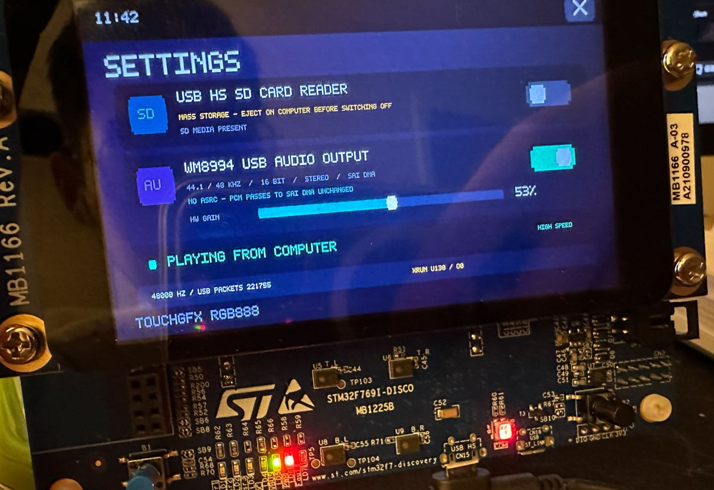

# STM32F769I-DISCO-USB-Audio-Upsampler
Use the USB OTG interface for input as a computer sound card, use the SPDIF interface to output digital music, supports Windows UAC2 asynchronous transmission

The original intention of this project was to address R2R 16bit audio, or to design some high-fidelity asynchronous USB interfaces in USB that can preserve the original audio information

Support: Linux / UAC1 asynchronous audio,  Windows /UAC2 asynchronous audio interface
Input: 16bit 44.1kHz/ 48kHz, WM8994 supports local music playback, 

# STM32F769I-DISCO S/PDIF 4× Upsampling Algorithms
This project provides multiple native playback and 4× upsampling algorithms for S/PDIF output,  which can be switched in the SETTINGS application.

Supported input formats:
- 16-bit / 44.1 kHz
- 16-bit / 48 kHz

Corresponding SPDIF 4× output formats:
- 44.1 kHz → 176.4 kHz
- 48 kHz → 192 kHz

4× upsampling is currently applied only to 16-bit audio. When playing 24-bit WAV,  it will automatically fall back to NATIVE mode.
The selected setting is saved to the RTC backup register and remains retained after a system reset.

## Mode Comparison

| Mode | Interpolation Algorithm | Gain | TPDF | Phase Characteristics | Performance Overhead |
|---|---|---:|---|---|---|
| NATIVE | No interpolation | 0 dB | None | Preserves original data | Lowest |
| 4X HOLD | Sample repetition | 0 dB | None | No phase correction | Very low |
| 4X EXACT | Nyquist FIR | 0 dB | None | Linear phase | Medium |
| 4X -1DB | Nyquist FIR | −1 dB | None | Linear phase | Medium |
| 4X TPDF | Nyquist FIR | −1 dB | Four-phase TPDF | Linear phase | Medium |
| 4X IIR | 14th-order IIR | −1 dB | Four-phase TPDF | Nonlinear phase | Medium-high |
| HYBRID | 14th-order IIR + 32-tap FIR | −1 dB | Four-phase TPDF | Approximately fixed group delay | Highest |
| HYBRID NS2 | 14th-order IIR + 32-tap FIR + 2nd order Noise shaping | −1 dB | Four-phase TPDF + NS2 | Approximately fixed group delay | Highest |
| BTR NS2 | 14th-order Butterworth IIR + 32-tap soft FIR + 2nd order Noise shaping | −1 dB | Four-phase TPDF + NS2 | Approximately fixed group delay | Highest |
| BTR MIN | 14th-order Butterworth IIR + 2nd order Noise shaping | −1 dB | Four-phase TPDF + NS2 | Nonlinear phase | Medium-high |
| BES MIN | 20th-order Bessel IIR + 2nd order Noise shaping | −1 dB | Four-phase TPDF + NS2 | mild Nonlinear phase | Highest |
| BES OPEN | 20th-order Bessel IIR + 2nd order Noise shaping | −2.25 dB | Four-phase TPDF + NS2 | mild Nonlinear phase | Highest |
---

## NATIVE
No upsampling,  gain processing,  or dithering is performed.
Data is sent to S/PDIF at the original sample rate:
- 44.1 kHz input → 44.1 kHz output
- 48 kHz input → 48 kHz output
This mode has the lowest CPU usage and makes the fewest modifications to the original PCM.

## 4X HOLD
Using the Zero-Order Hold method,  output each input sample point four consecutive times.
PCM → Repeat each sample 4 times → S/PDIF

## 4X EXACT
Use a 129-point four-phase Nyquist FIR interpolator.

Where:
- Phase0 is the original sample delayed by 16 input frames
- Phase0 remains bit-perfect
- Phase1～3 are each calculated using a 32-tap Q15 polyphase FIR
- No amplitude attenuation
- No TPDF added

PCM → 4-phase Nyquist FIR → 16-bit quantization → S/PDIF

## 4X -1DB

Use the same Nyquist FIR as 4X EXACT,  but uniformly lower all four Phases by 1 dB before final quantization

Less prone to transient clipping than 4X EXACT

## 4X TPDF
On top of 4X -1DB,  add TPDF dither before the final 16-bit quantization.
PCM → 4-phase Nyquist FIR → −1 dB → four-phase TPDF → 16-bit quantization → S/PDIF

## 4X IIR

Use zero-stuffing upsampling and a 14th-order Chebyshev-I low-pass IIR.

The IIR consists of 7 cascaded second-order DF2T filter sections,  with coefficients precomputed separately for 44.1 kHz and 48 kHz.

PCM → −1 dB → insert 3 zero samples → 14th-order Chebyshev-I IIR → four-phase TPDF → 16-bit quantization → S/PDIF

####Filter parameters:
- 4× output sample rate
- 20 kHz passband
- Approximately 0.25 dB passband ripple
- The 44.1 kHz path has approximately 62 dB attenuation at the first image edge
- The 48 kHz path has a wider transition band and higher image attenuation

####Features:
- Compared with a Butterworth filter with the same transition band,  a steeper cutoff can be achieved with a lower order
- Uses Cortex-M7 hardware floating-point and FMA instructions
- Has nonlinear phase
- Group delay gradually increases near high frequencies
- Transients may produce IIR ringing
At the end of the WAV file,  256 zero-valued source frames continue to be fed in,  allowing the IIR's recursive response to decay to near the 16-bit noise floor.

## 4X HYBRID
HYBRID is based on 4X IIR,  with a 32-tap FIR phase equalizer added after the IIR. (64-tap performance overhead is too high)

PCM → −1 dB → 4×zero insertion → 14th-order Chebyshev-I IIR → 32-tap FIR phase equalization → four-phase TPDF → 16-bit quantization → S/PDIF

The FIR does not replace the IIR low-pass filter,  but instead approximately corrects the nonlinear phase produced by the IIR.

####Phase equalizer parameters:
- 32 taps
- Independent history state for the left and right channels
- Different coefficients are used for 44.1 and 48 kHz
- Target total group delay is 44 high-sample-rate samples
- The primary optimization range is 0～18 kHz

####Corresponding target group delay:
- 176.4 kHz: approximately 0.249 ms
- 192 kHz: approximately 0.229 ms

####0～18 kHz group delay correction error:
- 176.4 kHz: RMS approximately 0.71 samples
- 192 kHz: RMS approximately 0.80 samples
- When approaching the IIR's steep 20 kHz cutoff region,  a finite-length causal FIR cannot completely reverse the IIR phase,  so the phase correction capability in the 19～20 kHz range gradually decreases.

####Performance optimization:
- FIR reduced from the original 64 taps to 32 taps
- Loop unrolled once every 4 taps
- Uses Cortex-M7 hardware floating-point FMA
- FIR executes approximately 12.3 million floating-point FMAs/second
- Runtime state is located in internal DTCM
- External SDRAM is not used
At the end of the WAV,  zero values continue to be fed in,  allowing the IIR recursive response to decay,  and the FIR history is cleared.

## 4X HYB NS2
Use second-order error feedback: NTF = (1 − z⁻¹)²

Automatically clear noise-shaping history upon saturation

Does not clear the IIR/FIR filter history, so it will not restart the entire filter or interrupt the audio stream

PCM → −1 dB → 4×zero insertion → 14th-order Chebyshev-I IIR → 32-tap FIR phase equalization → four-phase TPDF + 2nd order Noise shaping → 16-bit quantization → S/PDIF

## 4X BTR NS2
Replace the Chebyshev filter with a less aggressive butterworth filter，raise the passband cutoff frequency at 44.1kHz from 20k to 22k，at 48kHz from 20k to 24k，reduce phase correction by 35%，to obtain richer musical information

## Phase and Clock Jitter
PLLI2S directly generates the SAI2/S/PDIF clock. As long as the CPU can complete buffer filling before the DMA deadline,  the filtering algorithm will not change the S/PDIF clock edges.

####Insufficient performance may cause:
- DMA underrun
- Repetition of the old buffer
- PCM timeline jumps
- Pops or stuttering
- These are XRUNs or data discontinuities,  not continuous clock jitter.

####The current S/PDIF DMA configuration is:
- Circular DMA
- Very High DMA Priority
- FIFO Enabled
- Full FIFO Threshold
- INCR4 Memory Burst
- Independent PLLI2S clock

## Recommended choice
- Lowest CPU usage: NATIVE
- Simple 4x output and algorithm testing: 4X HOLD
- Linear phase while preserving the original Phase0: 4X EXACT
- Linear phase with peak headroom reserved: 4X -1DB
- Recommended FIR upsampling mode: 4X TPDF
- Prefer IIR sound characteristics and shorter group delay: 4X IIR
- Want to combine IIR cutoff characteristics with approximate phase correction: HYBRID

## When using it,  don't forget to switch the 5V power input jumper on the circuit board to USB-OTG

known issue: Due to the non-audio clock,  the buffer may be exhausted after 8 minutes,  which may possibly be resolved later by making an Arduino Shield with an external audio crystal oscillator. After the buffer is exhausted there will be a slight stutter to wait for 8192 frames of data to fill up before playback continues

Update: A slider has been added to the settings options to control the startup buffer time, for SPDIF 44.1kHz it is recommended to slide it toward the 30720 end (If you have no requirements for audio startup latency), for SPDIF 48kHz,  WM8994 44.1kHz,  WM8994 48kHz slide it toward the 6144-frame end (Usually Windows WASAPI will automatically switch between 44.1kHz or 48kHz depending on the audio files,  so it is recommended that when using SPDIF you move the slider to the middle position,  so that even over long periods of time there will be no buffer overflow or underrun issues)

WM8994 44.1Khz
PLLI2S 429/2/19
44.1 kHz actual approximately 44099.51 Hz, −11.19 ppm No need to worry about overflow

SPDIF 44.1Khz
PLLI2S 271/2/6
44.1 kHz actual approximately 44108.07 Hz, +183.06 ppm

Buffer underrun：Stop SAI/DMA, wait again for the startup watermark selected on the settings page. By default wait for 8192 input frames；if the slider is set to 6144 or 30720,  wait for the corresponding number of frames before restarting respectively.

Buffer overrun：Playback will not stop or wait again. The system discards the USB data that cannot be written this time, records one Overrun, and uses asynchronous Feedback to try to reduce the host sending speed,  restoring the watermark.
